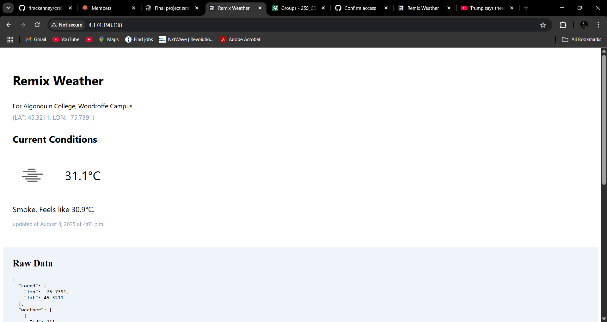

# CST8918 – DevOps: Infrastructure as Code  
**Professor:** Robert McKenney

# 🌦 Weather App — Final Project (Terraform + AKS + Redis + GHCR + GitHub Actions)

This repo contains a complete, working deployment of a **Remix Weather App** on **Azure Kubernetes Service (AKS)** with **Redis caching**, container images hosted on **GHCR**, Terraform state in **Azure Storage**, and **GitHub Actions** workflows (plan/apply + app CI/CD).

---

## 1) What we built

- **Infrastructure (Terraform)**
  - Remote backend in Azure Storage for Terraform state
  - **AKS** clusters: `test` (1 node) and `prod` (1–3 nodes in requirement; we ran basic 1 node to keep cost down)
  - **Azure Container Registry (ACR)** (optional – we used GHCR for the app image)
  - **Azure Cache for Redis** (test & prod)
- **Application**
  - Remix app (frontend+server) with an **OpenWeather API** integration
  - **Redis cache** layer to store weather responses for 10 minutes
  - Containerized via **Docker** and published to **GHCR**
  - Deployed to AKS via Kubernetes **Deployment** + **Service (LoadBalancer)**
- **Automation (GitHub Actions)**
  - Static checks (fmt/validate/tfsec)
  - Plan on PR, Apply on main
  - Build & push container to GHCR on app changes
  - Deploy to AKS test on PR, to prod on merge

---

## 2) Folder structure (final)
```pgsql
.
├─ app/ # Remix app source (server-rendered, calls OpenWeather + Redis)
├─ k8s/
│ └─ deployment-test.yaml # Deployment + Service + ENV for the app (uses GHCR image)
├─ terraform/
│ ├─ main.tf # AKS (test/prod), Redis (test/prod), ACR (optional)
│ ├─ provider.tf # backend azurerm + provider
│ └─ variables.tf
├─ .github/workflows/ # Terraform + app CI/CD workflows
├─ Dockerfile # Multi-stage build (builds Remix and serves via remix-serve)
└─ README.md # This file

```

> We intentionally **kept one clean Terraform root** to avoid duplicate providers/variables from old experiments. Legacy tf files were archived/removed so `terraform init/plan/apply` stays clean.

---

## 3) Step-by-step we followed

### A) Terraform backend (Azure Storage)
1. Created a **resource group** `tfstate-rg` and **storage account** `stroageweatherapp` (with container `container1`) for Terraform state.
2. Configured backend in `terraform/provider.tf`:
   ```hcl
   backend "azurerm" {
     resource_group_name  = "tfstate-rg"
     storage_account_name = "stroageweatherapp"
     container_name       = "container1"
     key                  = "terraform.tfstate"
   }
In GitHub Actions, we fetched the storage account key at runtime and passed it to terraform init so the workflow can use the backend.

### B) AKS version gotcha & fix
We initially tried Kubernetes versions like 1.27/1.28 LTS, but AKS requires Premium + LTS plan for those tracks.

Resolved by using a KubernetesOfficial supported version for Canada Central (e.g., 1.31.10 at time of deployment).

After update, terraform apply created clusters successfully.

### C) Build & push container (GHCR)
Fixed GHCR naming rules (must be lowercase):
ghcr.io/ajaymorla1508/weather-app:<tag>

Installed docker buildx and built/pushed:

``` bash

docker buildx build -t ghcr.io/ajaymorla1508/weather-app:latest --push .
Created a GHCR docker pull secret in the cluster:
```
```bash
kubectl create secret docker-registry ghcr-secret \
  --docker-server=ghcr.io \
  --docker-username=<github-username> \
  --docker-password=<GHCR_TOKEN>
```
### D) Redis in Kubernetes
We deployed a standard Redis (ClusterIP service redis:6379).

In the app, we set REDIS_URL=redis://redis:6379.

We confirmed name resolution inside pods and used redis-cli to ping/pong.

### E) App deployment to AKS
k8s/deployment-test.yaml (Deployment + LoadBalancer Service)

Environment:

WEATHER_API_KEY from a Kubernetes secret

REDIS_URL=redis://redis:6379

After kubectl apply -f k8s/deployment-test.yaml, we got a public IP from the Service and confirmed the app loaded.

Logs showed cache miss then cache hit, confirming Redis connectivity.

## 4) Key config snippets
Dockerfile (multi-stage)
``` dockerfile
# base image
FROM node:lts-alpine as base
RUN apk -U add --update-cache openssl
ENV NODE_ENV=production

# deps
FROM base as deps
WORKDIR /usr/src/app
ADD package.json ./
RUN npm install --include=dev

# production deps
FROM base as production-deps
WORKDIR /usr/src/app
COPY --from=deps /usr/src/app/node_modules ./node_modules
ADD package.json ./
RUN npm prune --omit=dev

# build
FROM base as build
WORKDIR /usr/src/app
COPY --from=deps /usr/src/app/node_modules ./node_modules
ADD . .
RUN npm run build

# final
FROM base as production
WORKDIR /usr/src/app
COPY --from=production-deps /usr/src/app/node_modules ./node_modules
COPY --from=build /usr/src/app/build ./build
COPY --from=build /usr/src/app/public ./public
COPY --from=build /usr/src/app/package.json ./package.json
CMD [ "/bin/sh", "-c", "./node_modules/.bin/remix-serve ./build/index.js" ]
App Redis connection (TypeScript)
```
```
ts
// app/data-access/redis-connection.ts
import { createClient } from 'redis'

const url = process.env.REDIS_URL || "redis://redis:6379"

export const redis = await createClient({ url })
  .on('error', (err) => console.error('Redis client connection error', err))
  .connect()
Kubernetes (App + Service)
```
```yaml

apiVersion: apps/v1
kind: Deployment
metadata:
  name: weather-app
spec:
  replicas: 1
  selector:
    matchLabels:
      app: weather-app
  template:
    metadata:
      labels:
        app: weather-app
    spec:
      containers:
        - name: weather-app
          image: ghcr.io/ajaymorla1508/weather-app:latest
          ports:
            - containerPort: 3000
          imagePullPolicy: Always
          env:
            - name: WEATHER_API_KEY
              valueFrom:
                secretKeyRef:
                  name: weather-secrets
                  key: WEATHER_API_KEY
            - name: REDIS_URL
              value: "redis://redis:6379"
      imagePullSecrets:
        - name: ghcr-secret
---
apiVersion: v1
kind: Service
metadata:
  name: weather-service
spec:
  type: LoadBalancer
  selector:
    app: weather-app
  ports:
    - port: 80
      targetPort: 3000
```
## 5) GitHub Actions (what’s included)
Terraform Static Checks on any push

terraform fmt -check, validate, tfsec

Plan on PR (auth via AZURE_CREDENTIALS, backend key pulled via az CLI)

Apply on main

Build & Push container to GHCR on app changes (tags image with commit SHA)

Deploy to AKS test on PR and prod on main (sets kubectl context, creates GHCR pull secret & WEATHER_API_KEY secret, applies manifests)

Secrets used:

AZURE_CREDENTIALS = { clientId, clientSecret, subscriptionId, tenantId }

GHCR_TOKEN = GitHub token with write:packages

WEATHER_API_KEY = OpenWeather key

(Secrets are repo-wide, so they work across all branches.)

6) How to run from scratch (quick guide)
Clone + set context

```bash
az login
az account set --subscription "<your-subscription-id>"
Terraform
```

```bash

cd terraform
terraform init -reconfigure
terraform plan
terraform apply
Build & push image
```
``` bash

docker buildx build -t ghcr.io/<your-gh-username>/weather-app:latest --push .
Kubernetes
```
```bash
# Set AKS context (example for test)
az aks get-credentials -g cst8918-final-project-group-03 -n aks-weather-test
```
# Secrets
```bash
kubectl create secret docker-registry ghcr-secret \
  --docker-server=ghcr.io \
  --docker-username=<github-username> \
  --docker-password=<GHCR_TOKEN>

kubectl create secret generic weather-secrets \
  --from-literal=WEATHER_API_KEY=<your-openweather-key>
```
# Deploy app
```bash
kubectl apply -f k8s/deployment-test.yaml
kubectl get svc weather-service
Open in browser
http://<EXTERNAL-IP> from the weather-service LoadBalancer
```

7) Troubleshooting log (what we fixed)
AKS K8s version: 1.27/1.28 LTS requires premium + LTS plan → switched to 1.31.10 (KubernetesOfficial).

GHCR image name must be lowercase.

Docker buildx missing: installed buildx locally to enable push.

Service 80 not responding initially: waited for LoadBalancer provisioning; verified pod logs; ensured container listens on 3000 and service targets 3000.

Redis connection errors:

pointed REDIS_URL to redis://redis:6379

confirmed weather-secrets and ghcr-secret

ensured redis service exists and resolves in cluster (ClusterIP)

Terraform duplicate provider: removed extra .tf files; kept one clean root.

8) Clean up
When finished, destroy resources to avoid charges:

```bash bash
cd terraform
terraform destroy
```
9) Credits
Course: CST8918 – DevOps: Infrastructure as Code

Professor: Robert McKenney
Group 13:Elsakaan, Iman
Morla, Ajay
Panseriya, Satyam 


